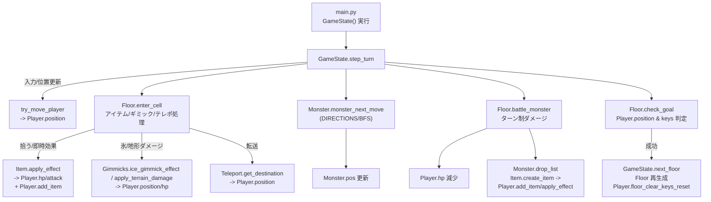

# MazeRPG – Map/JSON 仕様 & 実行手順

本プロジェクトは **grid（地形）をテキスト**, **オブジェクト/ギミック等は JSON** に分離した構成です。  

## ディレクトリ構成

```
.
├── README.md
├── TODO.md
├── main.py                   # 実行エントリ
├── modules                   # ゲームロジック一式
│   ├── constants.py
│   ├── floor.py
│   ├── game_state.py
│   ├── items.py
│   ├── monsters.py
│   ├── objects.py
│   ├── player.py
│   └── read_map_data.py
├── game_texts
│   ├── Basic_rule.txt
│   ├── Controls_guide.txt
│   ├── Firstgame_ui.txt
│   ├── Floor_rule.txt
│   └── Opening.txt
└── map_data
    ├── map01.txt
    ├── map01.json
    ├── map02.txt
    ├── map02.json
    ├── ...
    ├── sample01.txt
    ├── sample01.json
    └── ...

```

---

## マップ（TXT）

`[grid]` と `[info]` セクションのみを使用します。

- **[grid]**: `#`=壁, `.`=床 のみ。矩形で揃えてください。
- **[info]**: `json=ファイルパス` の1行だけ（相対パス推奨）。

```ini
[grid]
#######
#.....#
#.#...#
#.....#
#######

[info]
json=maps/map01.json
````

---

## JSON スキーマ

トップレベルのキー：

| key             | 型             | 必須           | 説明                |
| --------------- | ------------- | ------------ | ----------------- |
| `name`          | string        | 任意           | フロア名              |
| `reveal_hidden` | boolean       | 任意(既定: true) | 隠しアイテムは `?` で描画   |
| `start`         | [int,int]     | 必須           | プレイヤー開始座標 `(r,c)` |
| `goal`          | object        | 任意           | ゴール条件（下記）         |
| `items`         | array<object> | 任意           | アイテム/置き罠          |
| `monsters`      | array<object> | 任意           | モンスター             |
| `doors`         | array<object> | 任意           | ドア（鍵で開く障害）        |
| `chests`        | array<object> | 任意           | 宝箱（中身スポーン）        |
| `teleports`     | array<object> | 任意           | テレポータ             |
| `gimmicks`      | object        | 任意           | 氷やHP減少などのギミック     |

### goal

```json
"goal": {
  "type": "reach" | "keys_only" | "reach_and_keys",
  "multiple": false | true  // 複数のゴール. trueの場合 pos が2次元リストで渡される
  "pos": [r,c],   // type=reach または reach_and_keys で使用
  "keys": ["gold","red"]  // ゴールに必要な key の id. type=keys_only または reach_and_keys で使用
}
```

### items

```json
{"id":"W1","type":"weapon","pos":[1,2],"hidden":false,"params":{"atk":5}}
{"id":"P1","type":"potion","pos":[1,5],"hidden":true,"params":{}}
{"id":"K1","type":"key","pos":[2,6],"hidden":false}
{"id":"TR1","type":"trap","pos":[3,4],"hidden":false,"params":{"damage":10,"once":1}}
```

* `weapon`: 取得即 `ATK += atk`。指定しない場合 `1~10` でランダム。
* `potion`: インベントリに入る。`u` で使用→HP全快
* `key`: `id` をプレイヤーが所持
* `trap`: 踏むと `damage` ダメージ。`once=1` なら一度きり。

### monsters

```json
{"id":"M1","pos":[2,8],"ai_type":"static","move_every":0,"drop_list":["P1"]}
{"id":"M2","pos":[6,4],"ai_type":"random","ai_params":{"p":0.5},"move":1,"drop_list":[{"id": "hoge", "type": "key", "params": {}}]}
{"id":"M3","pos":[8,6],"ai_type":"chase","ai_params":{"range":6},"move":1}
{"id":"M4","pos":[10,11],"ai_type":"patrol","ai_params":{"path":[[10,11],[10,15],[8,15],[8,11]]},"move_every":2}
```

* `ai_type`: `static` / `random` / `chase` / `patrol`
* `move_every`: 何ターンごとに移動するか（0=動かない）
* `ai_params`:

  * `random`: `{ "p": 0.5 }` 移動確率
  * `chase`: `{ "range": 6 }` 追跡開始距離
  * `patrol`: `{ "path": [[r,c], ...] }` 巡回点
* `strength`: `'weak'` | `'normal'` | `'strong'`
* `drop_list`: 撃破時ドロップ。 `items` の書き方と同じ

> HP/ATK は**フロア入場時に自動設定**前提（実装側で難易度係数をかける等）。サンプル実装では未指定時に簡易値 `(hp=30, atk=6)` を補完。

### doors

```json
{"id":"Dgold","pos":[10,15],"requires_key":"gold","opened":false}
```

* 同セルに入ると自動で解錠を試みる（鍵条件を満たす場合のみ）。

### chests

```json
{"id":"C1","pos":[5,6],"requires_key":"red","opened":false,"contents":["generate:weapon:+7","P1"]}
```

* 同セルに入ると自動で開封を試みる。中身はセル上にスポーン。

### teleports

```json
{"id":"T1","source":[7,12],"target":[3,2],"bidirectional":true}
```

* 通過時に起動（双方向は `bidirectional: true`）。
* 鍵が必要な時は `requires_key: {key_id}`。

### gimmicks

```json
{
  "ice": {"regions": []},                    // 氷セル（直進）, リストが空の場合はマップ全域
  "terrain_damage": {"damage": 1, "regions": []}  // 地形罠
}
```

---

## ゲームループと操作

* 5フロアクリアでゲームクリア（`GameState.go_next_floor()` 内で判定）
* コマンド: **w/a/s/d** 移動, **u** ポーション使用, **q** 終了
* 描画優先: **プレイヤー > モンスター > ドア(閉) > チェスト(未開) > 隠しアイテム(?) > ゴール > テレポ > 床**
  隠しアイテムは `reveal_hidden=true` のとき `?` で表示（踏むと正体判明/取得）

---

```
@ ←プレイヤー
M ←モンスター
D ←閉じたドア
C ←未開宝箱
? ←隠しアイテム（reveal_hidden=true の場合）
G ←ゴール地点
T ←テレポ台
```

---

## ゲーム要件
- k層あるマップのうち5層クリアでゲームクリア。
  - ゲーム開始時にk層のうちランダムに5種類選ばれる。
- 各層は基本的に n * m サイズの迷路状である。
- プレイヤーは一マスずつ移動する。
- 各層によって異なるギミックがある（同一のギミックがあることもある）。
  - 壁にぶつかるまで直進し続ける。
  - 一度通った道が使えなくなる。
  - 1マス進むごとにHPが減少していく。
  - 特定のマスを通るとマップ上の別の場所に移動する。
- プレイヤーの初期ステータス: HP100, Attack10
- HPが0になるとゲームオーバー（敗北）となる。
- マップ内にモンスターがいることがある。
	- モンスターのいるマスに重なると、HPが0になるまでプレイヤーとモンスターの間でターン制の戦闘が発生する。
	- プレイヤー先行で、プレイヤーおよびモンスターは攻撃のみ可能である。
  - モンスターを倒すことで入手すことができるアイテムなどがある。
  - モンスターの挙動は階層ごとに異なる（不動、巡回、追跡、など）。
- マップ内にはアイテムが設置してあることがある。プレイヤーがアイテムや罠のあるマスに重なることでアイテムの効果が取得（反映）される。
	- 武器: プレイやの攻撃力が上昇する。取得時に即時反映される。
	- ポーション: 取得時インベントリに追加される。任意のタイミングで使用可能。プレイヤーのHPをプレイヤーの最大HPまで回復させる。
	- 鍵: マップゴールに必要であったり、マップ内に存在する宝箱を開けるのに必要であったりする。
	- 罠: プレイヤーに10のダメージを与える。即時反映される。
  - 宝箱: 特定の鍵を所持した状態のときに開けることができる。何らかのアイテムを入手することができる。

---

## modules ディレクトリ内ファイル概要
- `constants.py`: フロア選択数や総フロア数、移動ベクトル`DIRECTIONS`、描画記号`TILE_SYMBOLS`、データパスなどの共通定数をまとめる。
- `read_map_data.py`: マップの`.txt`を読み込み、`[grid]`と`[info]`を分離して`grid`と`json_path`を返すユーティリティ。
- `floor.py`: フロア1層分のモデル。`Floor`初期化時に`read_map_data`→JSON読み込みで`Item/Monster/Door/Chest/Teleport/Gimmicks`を生成。`print_grid`で描画、`enter_cell`でアイテム・ギミック・テレポ処理、`battle_monster`でターン制戦闘とドロップ生成、`check_goal`でゴール判定を担当。
- `game_state.py`: ゲーム全体の進行管理。フロア選択や`start_floor`で`Floor`生成、`step_turn`で入力→移動→`Floor.enter_cell`→モンスター行動→戦闘→`check_goal`を実行し、`next_floor`で進行を進める。`try_move_player`など入出力補助もここにある。
- `items.py`: アイテム階層。`Item`を基底に`Key/Weapon/Potion/Trap/Dummy`を用意し、`create_item`ファクトリでJSON定義から適切なクラスを生成。`Weapon.apply_effect`は`Player.equip_weapon`を呼び攻撃力を上げ、`Potion`/`Trap`はHPを直接回復・減少させる。
- `monsters.py`: `Monster`クラス。`init_status`で強さ係数からHP/攻撃力を決め、`increment_turn`で移動周期管理、`monster_next_move`で`static/random/chase/patrol`AIを切替、`bfs`で追跡経路を計算。`drop_list`は`Floor.battle_monster`経由で`Item`生成に使われる。
- `objects.py`: マップ上の構造物とギミック。`Door`/`Chest`/`Teleport`は位置と鍵条件を保持し、`Teleport.get_destination`がプレイヤー位置を転送。`Gimmicks`は氷床・地形ダメージ領域を管理し、`ice_gimmick_effect`で連続滑走と訪問セル追加、`apply_terrain_damage`で`Player.hp`を減少させる。
- `player.py`: `Player`クラス。位置・HP・攻撃力・所持品を管理し、`add_item`でインベントリ格納、`use_potion`で全回復、`equip_weapon`で最良武器を装備し攻撃力を再計算、`floor_clear_keys_reset`でフロア跨ぎの鍵をリセットする。

## クラス間の主な影響関係 (mermaid)


