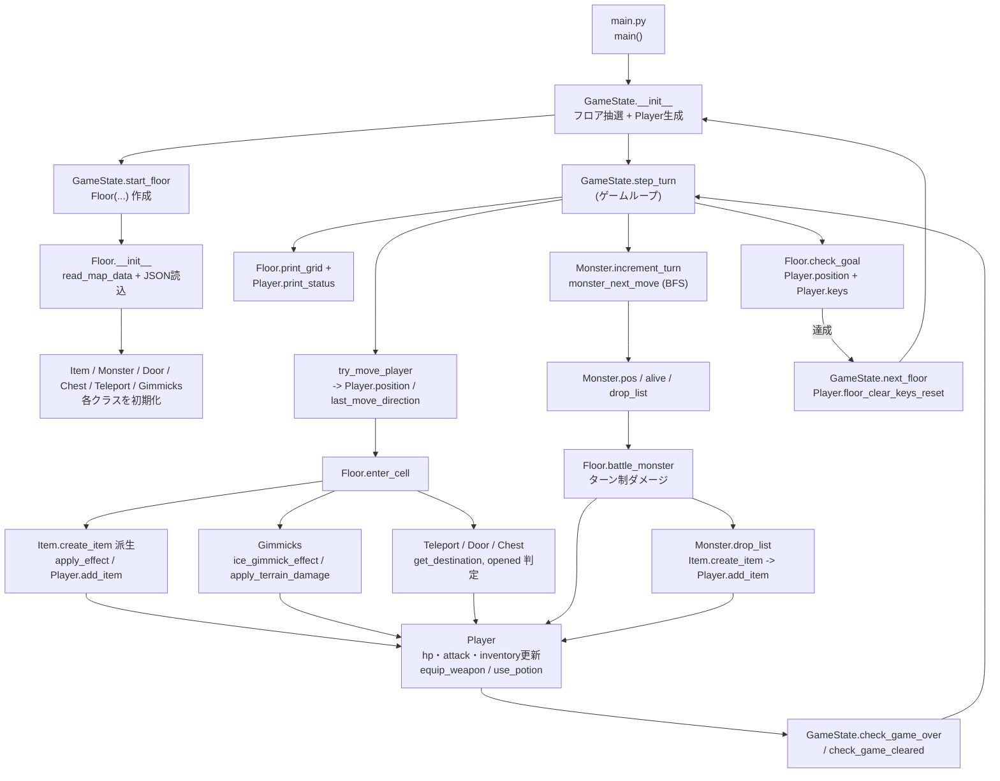
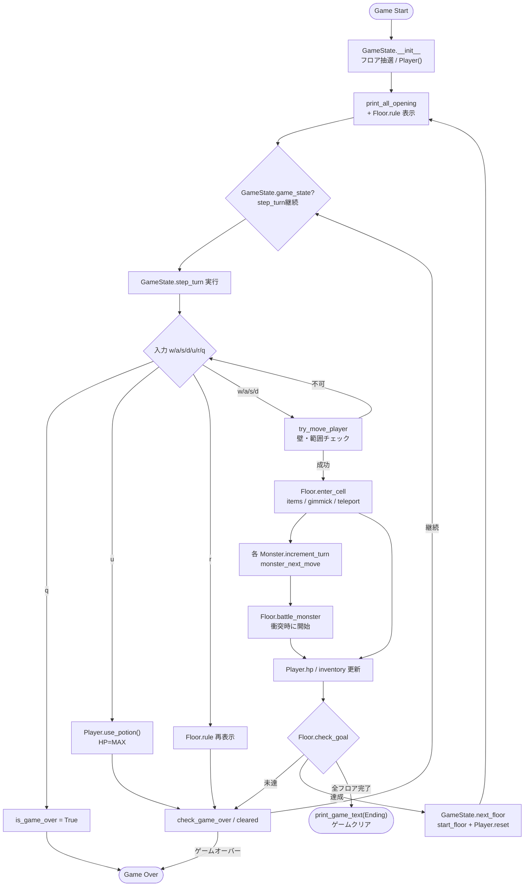
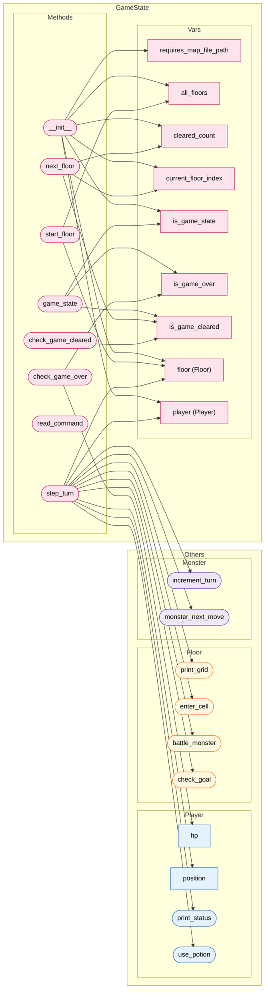
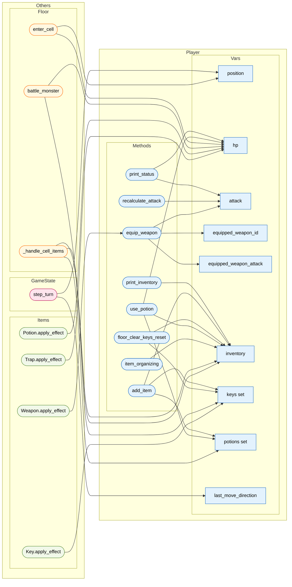
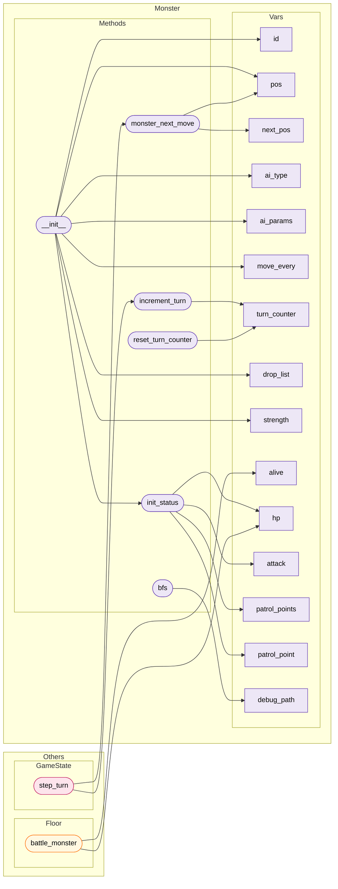
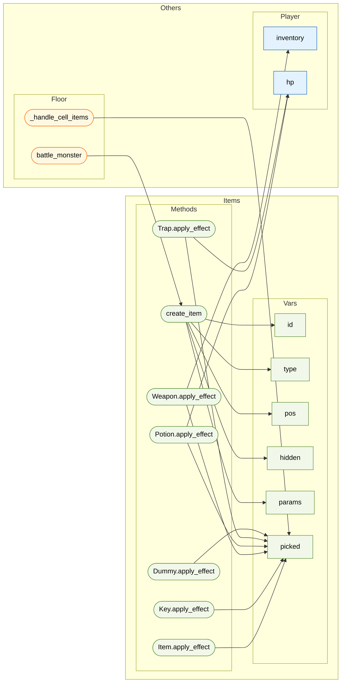
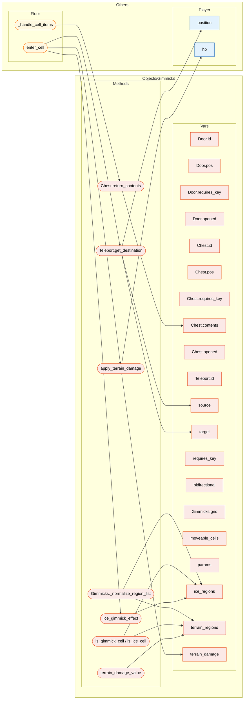

# MazeRPG – Map/JSON 仕様 & 実行手順

本プロジェクトは **grid（地形）をテキスト**, **オブジェクト/ギミック等は JSON** に分離した構成です。  

## ディレクトリ構成

```
.
├── README.md
├── TODO.md
├── main.py                   # 実行エントリ
├── modules                   # ゲームロジック一式
│   ├── constants.py
│   ├── floor.py
│   ├── game_state.py
│   ├── items.py
│   ├── monsters.py
│   ├── objects.py
│   ├── player.py
│   └── read_map_data.py
├── game_texts
│   ├── Basic_rule.txt
│   ├── Controls_guide.txt
│   ├── Firstgame_ui.txt
│   ├── Floor_rule.txt
│   └── Opening.txt
└── map_data
    ├── map01.txt
    ├── map01.json
    ├── map02.txt
    ├── map02.json
    ├── ...
    ├── sample01.txt
    ├── sample01.json
    └── ...

```

---

## マップ（TXT）

`[grid]` と `[info]` セクションのみを使用します。

- **[grid]**: `#`=壁, `.`=床 のみ。矩形で揃えてください。
- **[info]**: `json=ファイルパス` の1行だけ（相対パス推奨）。

```ini
[grid]
#######
#.....#
#.#...#
#.....#
#######

[info]
json=maps/map01.json
````

---

## JSON スキーマ

トップレベルのキー：

| key             | 型             | 必須           | 説明                |
| --------------- | ------------- | ------------ | ----------------- |
| `name`          | string        | 任意           | フロア名              |
| `reveal_hidden` | boolean       | 任意(既定: true) | 隠しアイテムは `?` で描画   |
| `start`         | [int,int]     | 必須           | プレイヤー開始座標 `(r,c)` |
| `goal`          | object        | 任意           | ゴール条件（下記）         |
| `items`         | array<object> | 任意           | アイテム/置き罠          |
| `monsters`      | array<object> | 任意           | モンスター             |
| `doors`         | array<object> | 任意           | ドア（鍵で開く障害）        |
| `chests`        | array<object> | 任意           | 宝箱（中身スポーン）        |
| `teleports`     | array<object> | 任意           | テレポータ             |
| `gimmicks`      | object        | 任意           | 氷やHP減少などのギミック     |

### goal

```json
"goal": {
  "type": "reach" | "keys_only" | "reach_and_keys",
  "multiple": false | true  // 複数のゴール. trueの場合 pos が2次元リストで渡される
  "pos": [r,c],   // type=reach または reach_and_keys で使用
  "keys": ["gold","red"]  // ゴールに必要な key の id. type=keys_only または reach_and_keys で使用
}
```

### items

```json
{"id":"W1","type":"weapon","pos":[1,2],"hidden":false,"params":{"atk":5}}
{"id":"P1","type":"potion","pos":[1,5],"hidden":true,"params":{}}
{"id":"K1","type":"key","pos":[2,6],"hidden":false}
{"id":"TR1","type":"trap","pos":[3,4],"hidden":false,"params":{"damage":10,"once":1}}
```

* `weapon`: 取得即 `ATK += atk`。指定しない場合 `1~10` でランダム。
* `potion`: インベントリに入る。`u` で使用→HP全快
* `key`: `id` をプレイヤーが所持
* `trap`: 踏むと `damage` ダメージ。`once=1` なら一度きり。

### monsters

```json
{"id":"M1","pos":[2,8],"ai_type":"static","move_every":0,"drop_list":["P1"]}
{"id":"M2","pos":[6,4],"ai_type":"random","ai_params":{"p":0.5},"move":1,"drop_list":[{"id": "hoge", "type": "key", "params": {}}]}
{"id":"M3","pos":[8,6],"ai_type":"chase","ai_params":{"range":6},"move":1}
{"id":"M4","pos":[10,11],"ai_type":"patrol","ai_params":{"path":[[10,11],[10,15],[8,15],[8,11]]},"move_every":2}
```

* `ai_type`: `static` / `random` / `chase` / `patrol`
* `move_every`: 何ターンごとに移動するか（0=動かない）
* `ai_params`:

  * `random`: `{ "p": 0.5 }` 移動確率
  * `chase`: `{ "range": 6 }` 追跡開始距離
  * `patrol`: `{ "path": [[r,c], ...] }` 巡回点
* `strength`: `'weak'` | `'normal'` | `'strong'`
* `drop_list`: 撃破時ドロップ。 `items` の書き方と同じ

> HP/ATK は**フロア入場時に自動設定**前提（実装側で難易度係数をかける等）。サンプル実装では未指定時に簡易値 `(hp=30, atk=6)` を補完。

### doors

```json
{"id":"Dgold","pos":[10,15],"requires_key":"gold","opened":false}
```

* 同セルに入ると自動で解錠を試みる（鍵条件を満たす場合のみ）。

### chests

```json
{"id":"C1","pos":[5,6],"requires_key":"red","opened":false,"contents":["generate:weapon:+7","P1"]}
```

* 同セルに入ると自動で開封を試みる。中身はセル上にスポーン。

### teleports

```json
{"id":"T1","source":[7,12],"target":[3,2],"bidirectional":true}
```

* 通過時に起動（双方向は `bidirectional: true`）。
* 鍵が必要な時は `requires_key: {key_id}`。

### gimmicks

```json
{
  "ice": {"regions": []},                    // 氷セル（直進）, リストが空の場合はマップ全域
  "terrain_damage": {"damage": 1, "regions": []}  // 地形罠
}
```

---

## ゲームループと操作

* 5フロアクリアでゲームクリア（`GameState.go_next_floor()` 内で判定）
* コマンド: **w/a/s/d** 移動, **u** ポーション使用, **q** 終了
* 描画優先: **プレイヤー > モンスター > ドア(閉) > チェスト(未開) > 隠しアイテム(?) > ゴール > テレポ > 床**
  隠しアイテムは `reveal_hidden=true` のとき `?` で表示（踏むと正体判明/取得）

---

```
@ ←プレイヤー
M ←モンスター
D ←閉じたドア
C ←未開宝箱
? ←隠しアイテム（reveal_hidden=true の場合）
G ←ゴール地点
T ←テレポ台
```

---

## ゲーム要件
- k層あるマップのうち5層クリアでゲームクリア。
  - ゲーム開始時にk層のうちランダムに5種類選ばれる。
- 各層は基本的に n * m サイズの迷路状である。
- プレイヤーは一マスずつ移動する。
- 各層によって異なるギミックがある（同一のギミックがあることもある）。
  - 壁にぶつかるまで直進し続ける。
  - 一度通った道が使えなくなる。
  - 1マス進むごとにHPが減少していく。
  - 特定のマスを通るとマップ上の別の場所に移動する。
- プレイヤーの初期ステータス: HP100, Attack10
- HPが0になるとゲームオーバー（敗北）となる。
- マップ内にモンスターがいることがある。
	- モンスターのいるマスに重なると、HPが0になるまでプレイヤーとモンスターの間でターン制の戦闘が発生する。
	- プレイヤー先行で、プレイヤーおよびモンスターは攻撃のみ可能である。
  - モンスターを倒すことで入手すことができるアイテムなどがある。
  - モンスターの挙動は階層ごとに異なる（不動、巡回、追跡、など）。
- マップ内にはアイテムが設置してあることがある。プレイヤーがアイテムや罠のあるマスに重なることでアイテムの効果が取得（反映）される。
	- 武器: プレイやの攻撃力が上昇する。取得時に即時反映される。
	- ポーション: 取得時インベントリに追加される。任意のタイミングで使用可能。プレイヤーのHPをプレイヤーの最大HPまで回復させる。
	- 鍵: マップゴールに必要であったり、マップ内に存在する宝箱を開けるのに必要であったりする。
	- 罠: プレイヤーに10のダメージを与える。即時反映される。
  - 宝箱: 特定の鍵を所持した状態のときに開けることができる。何らかのアイテムを入手することができる。

---

## modules ディレクトリ内ファイル概要
- `constants.py`: フロア選択数や総フロア数、移動ベクトル`DIRECTIONS`、描画記号`TILE_SYMBOLS`、データパスなどの共通定数をまとめる。
- `read_map_data.py`: マップの`.txt`を読み込み、`[grid]`と`[info]`を分離して`grid`と`json_path`を返すユーティリティ。
- `floor.py`: フロア1層分のモデル。`Floor`初期化時に`read_map_data`→JSON読み込みで`Item/Monster/Door/Chest/Teleport/Gimmicks`を生成。`print_grid`で描画、`enter_cell`でアイテム・ギミック・テレポ処理、`battle_monster`でターン制戦闘とドロップ生成、`check_goal`でゴール判定を担当。
- `game_state.py`: ゲーム全体の進行管理。フロア選択や`start_floor`で`Floor`生成、`step_turn`で入力→移動→`Floor.enter_cell`→モンスター行動→戦闘→`check_goal`を実行し、`next_floor`で進行を進める。`try_move_player`など入出力補助もここにある。
- `items.py`: アイテム階層。`Item`を基底に`Key/Weapon/Potion/Trap/Dummy`を用意し、`create_item`ファクトリでJSON定義から適切なクラスを生成。`Weapon.apply_effect`は`Player.equip_weapon`を呼び攻撃力を上げ、`Potion`/`Trap`はHPを直接回復・減少させる。
- `monsters.py`: `Monster`クラス。`init_status`で強さ係数からHP/攻撃力を決め、`increment_turn`で移動周期管理、`monster_next_move`で`static/random/chase/patrol`AIを切替、`bfs`で追跡経路を計算。`drop_list`は`Floor.battle_monster`経由で`Item`生成に使われる。
- `objects.py`: マップ上の構造物とギミック。`Door`/`Chest`/`Teleport`は位置と鍵条件を保持し、`Teleport.get_destination`がプレイヤー位置を転送。`Gimmicks`は氷床・地形ダメージ領域を管理し、`ice_gimmick_effect`で連続滑走と訪問セル追加、`apply_terrain_damage`で`Player.hp`を減少させる。
- `player.py`: `Player`クラス。位置・HP・攻撃力・所持品を管理し、`add_item`でインベントリ格納、`use_potion`で全回復、`equip_weapon`で最良武器を装備し攻撃力を再計算、`floor_clear_keys_reset`でフロア跨ぎの鍵をリセットする。

## クラス間の主な影響関係 (mermaid)


## ゲーム全体フロー (mermaid)


## ????????????? (mermaid)
?????????????????????????????Others > ???????????????????????????

### GameState


**GameState が利用する他クラスのメンバー**
- `Floor.__init__` / `Floor.start` ― `GameState.__init__` と `start_floor` がフロア生成時に呼び出し（modules/game_state.py:28-34, 80-92）。
- `Player` ― `GameState.__init__` で `Player(self.floor.start)` を生成し、`next_floor` で `player.floor_clear_keys_reset()` を呼ぶ（modules/game_state.py:31, 56）。
- `Player.print_status` / `Player.use_potion` / `Player.recalculate_attack` ― `step_turn` がステータス表示・ポーション使用・ゴール後の攻撃力再計算で使用（modules/game_state.py:96, 108, 162）。
- `Floor.print_grid` / `Floor.enter_cell` / `Floor.battle_monster` / `Floor.check_goal` ― `step_turn` の描画・イベント・戦闘・ゴール判定処理（modules/game_state.py:94, 126, 151, 154）。
- `Monster.increment_turn` / `Monster.monster_next_move` ― 1ターン毎のAI更新（modules/game_state.py:130-147）。
- `try_move_player` / `DIRECTIONS` ― 入力に応じてプレイヤー座標を算出（modules/game_state.py:117, 201-218）。

**GameState が他クラスから参照される箇所**
- `main.py:9` と `main.py:14` で `GameState()` を生成してゲームループを駆動。
- `modules/game_state.py` 以外から直接 GameState の変数・メソッドを読む箇所はなく、外部公開 API は `GameState.game_state()` と `GameState.step_turn()` のみ。

### Floor

```mermaid
graph LR
  classDef floor fill:#fff8e1,stroke:#ff6f00,color:#000;
  classDef gs fill:#fde4ec,stroke:#c2185b,color:#000;
  classDef player fill:#e3f2fd,stroke:#1565c0,color:#000;
  classDef monster fill:#ede7f6,stroke:#5e35b1,color:#000;
  classDef items fill:#f1f8e9,stroke:#558b2f,color:#000;
  classDef obj fill:#fbe9e7,stroke:#e64a19,color:#000;
  subgraph Main_Floor["Floor"]
    direction LR
    subgraph FL_V["Vars"]
      direction TB
      FL_id["floor_id"]:::floor
      FL_grid["grid"]:::floor
      FL_json["json_path"]:::floor
      FL_map["map_size"]:::floor
      FL_move["movable_cells"]:::floor
      FL_info["info (JSON)"]:::floor
      FL_name["name"]:::floor
      FL_reveal["reveal_hidden"]:::floor
      FL_start["start"]:::floor
      FL_goal_type["goal.type"]:::floor
      FL_goal_pos["goal.pos"]:::floor
      FL_goal_keys["goal.keys"]:::floor
      FL_items["items dict"]:::floor
      FL_monsters["monsters dict"]:::floor
      FL_doors["doors dict"]:::floor
      FL_chests["chests dict"]:::floor
      FL_tp["teleports dict"]:::floor
      FL_gimmicks["gimmicks"]:::floor
      FL_rule["rule text"]:::floor
    end
    subgraph FL_M["Methods"]
      direction TB
      FL_ctor(["__init__"]):::floor
      FL_read(["_read_json_data"]):::floor
      FL_goal_init(["_goal_init"]):::floor
      FL_items_init(["_items_init"]):::floor
      FL_mons_init(["_monsters_init"]):::floor
      FL_doors_init(["_doors_init"]):::floor
      FL_chests_init(["_chests_init"]):::floor
      FL_tp_init(["_teleports_init"]):::floor
      FL_gim_init(["_gimmicks_init"]):::floor
      FL_rule_init(["_rules_init"]):::floor
      FL_collect(["_collect_entity_symbols"]):::floor
      FL_print(["print_grid"]):::floor
      FL_handle(["_handle_cell_items"]):::floor
      FL_enter(["enter_cell"]):::floor
      FL_battle(["battle_monster"]):::floor
      FL_goal_chk(["check_goal"]):::floor
      FL_info_print(["print_info"]):::floor
    end
  end
  subgraph Others
    direction TB
    subgraph O_GameState["GameState"]
      direction TB
      GS_step_ext(["step_turn"]):::gs
      GS_start_ext(["start_floor"]):::gs
    end
    subgraph O_PlayerF["Player"]
      direction TB
      PL_pos_ext["position"]:::player
      PL_hp_ext["hp"]:::player
      PL_inv_ext["inventory"]:::player
    end
    subgraph O_Items["Items"]
      direction TB
      IT_create_ext(["create_item"]):::items
      IT_apply_ext(["Item.apply_effect"]):::items
    end
    subgraph O_Monsters["Monster"]
      direction TB
      MON_ctor_ext(["__init__"]):::monster
      MON_hp_ext["hp"]:::monster
      MON_alive_ext["alive"]:::monster
    end
    subgraph O_Obj["Objects/Gimmicks"]
      direction TB
      TP_dest_ext(["Teleport.get_destination"]):::obj
      GM_apply_ext(["apply_terrain_damage"]):::obj
      GM_ice_ext(["ice_gimmick_effect"]):::obj
      CH_return_ext(["Chest.return_contents"]):::obj
    end
  end
  FL_ctor --> FL_grid
  FL_ctor --> FL_json
  FL_ctor --> FL_map
  FL_ctor --> FL_move
  FL_ctor --> FL_info
  FL_ctor --> FL_name
  FL_ctor --> FL_reveal
  FL_ctor --> FL_start
  FL_goal_init --> FL_goal_type
  FL_goal_init --> FL_goal_pos
  FL_goal_init --> FL_goal_keys
  FL_items_init --> FL_items
  FL_mons_init --> FL_monsters
  FL_doors_init --> FL_doors
  FL_chests_init --> FL_chests
  FL_tp_init --> FL_tp
  FL_gim_init --> FL_gimmicks
  FL_rule_init --> FL_rule
  FL_collect --> FL_items
  FL_collect --> FL_monsters
  FL_collect --> FL_doors
  FL_collect --> FL_chests
  FL_collect --> FL_tp
  FL_print --> FL_collect
  FL_handle --> FL_items
  FL_enter --> FL_handle
  FL_enter --> FL_gimmicks
  FL_enter --> FL_tp
  FL_battle --> FL_monsters
  FL_goal_chk --> FL_goal_pos
  FL_goal_chk --> FL_goal_keys
  GS_step_ext --> FL_print
  GS_step_ext --> FL_enter
  GS_step_ext --> FL_battle
  GS_step_ext --> FL_goal_chk
  GS_start_ext --> FL_ctor
  FL_handle --> PL_inv_ext
  FL_enter --> PL_pos_ext
  FL_enter --> PL_hp_ext
  FL_handle --> IT_apply_ext
  FL_enter --> GM_ice_ext
  FL_enter --> GM_apply_ext
  FL_enter --> TP_dest_ext
  FL_battle --> MON_hp_ext
  FL_battle --> MON_alive_ext
  FL_battle --> IT_create_ext
  FL_handle --> CH_return_ext
```


**Floor が利用する他クラスのメンバー**
- `Item.create_item` ― `_items_init` でマップ定義からインスタンス化し、`battle_monster` のドロップ生成でも呼び出し（modules/floor.py:192-200, 349-355）。
- `Monster` / `Door` / `Chest` / `Teleport` / `Gimmicks` ― それぞれの `_init` 系メソッドで JSON を読み込みクラスを生成（modules/floor.py:152-211）。
- `Player.position` ― `print_grid` で描画位置を特定し、`enter_cell` / `check_goal` でゴール判定・ギミック処理を実行（modules/floor.py:266, 308-324, 383-398）。
- `Player.add_item` / `player.hp` / `player.attack` ― `_handle_cell_items` や `battle_monster` 内でアイテム効果・戦闘結果を反映（modules/floor.py:301-360）。
- `Gimmicks.ice_gimmick_effect` / `apply_terrain_damage` ― `enter_cell` で氷床・ダメージ床を処理（modules/floor.py:309-318）。
- `Teleport.get_destination` ― `enter_cell` から転送先を決定（modules/floor.py:321-324）。

**Floor が他クラスから参照される箇所**
- `GameState.__init__` / `start_floor` が `Floor` を生成し `self.floor` に保持（modules/game_state.py:28-34, 80-92）。
- `GameState.step_turn` が `print_grid`, `enter_cell`, `battle_monster`, `check_goal`, `floor.monsters` を直接呼び出し（modules/game_state.py:94-155）。
- `GameState.step_turn` と `try_move_player` が `floor.grid` / `floor.start` / `floor.rule` を参照（modules/game_state.py:33, 117, 160-165, 201-218）。

### Player


**Player が参照する／される主要箇所**
- `GameState.step_turn` が `Player.position` を更新し、`last_move_direction`・`print_status()`・`use_potion()` を呼び出し（modules/game_state.py:94-123, 108）。
- `try_move_player` が `player.position` を読み取り移動可否を判定（modules/game_state.py:201-218）。
- `Floor.print_grid` / `Floor.enter_cell` / `Floor.check_goal` が `Player.position` を参照して描画やゴール判定を処理（modules/floor.py:266, 308-324, 383-398）。
- `Floor.enter_cell` / `Floor.battle_monster` / `GameState.check_game_over` / `Items.Potion.apply_effect` / `Items.Trap.apply_effect` が `Player.hp` を増減（modules/floor.py:316-360, modules/game_state.py:66, modules/items.py:53-64）。
- `Floor.battle_monster` が `Player.attack` を使ってモンスターHPを計算し、ドロップ処理で `player.add_item()` を呼ぶ（modules/floor.py:340-355）。
- `Floor.check_goal` が `player.inventory` / `player.keys` を参照して鍵条件を確認（modules/floor.py:388-399）。
- `Gimmicks.ice_gimmick_effect` が `player.last_move_direction` を参照して滑走方向を決める（modules/objects.py:108-122）。
- `GameState.next_floor` が `player.floor_clear_keys_reset()` を呼び、ゴール後 `player.recalculate_attack()` で攻撃力を再計算（modules/game_state.py:56, 162）。

### Monster


**Monster が参照する／される主要箇所**
- `GameState.step_turn` が各 `monster.increment_turn()` / `monster.monster_next_move()` を呼んで `monster.pos` を更新し、`occupied` セットで衝突判定を行う（modules/game_state.py:130-149）。
- `Floor._collect_entity_symbols` と `Floor.print_grid` が `monster.alive`, `monster.strength`, `monster.pos` を描画に利用（modules/floor.py:229-233）。
- `Floor.battle_monster` が `monster.hp`, `monster.attack`, `monster.drop_list`, `monster.alive` を更新し、勝敗を決める（modules/floor.py:340-360）。
- `GameState.step_turn` の戦闘判定でも `monster.pos` が `Player.position` と比較される（modules/game_state.py:146-150）。

### Items


**Items が参照する／される主要箇所**
- `Floor._items_init` / `Floor.battle_monster` が `Item.create_item()` を呼び、マップ定義やドロップから実体化（modules/floor.py:192-200, 349-355）。
- `Floor._handle_cell_items` が `Item.apply_effect()` を実行し、`player.add_item()` や `Item.picked` を更新（modules/floor.py:296-305）。
- `Items.Weapon.apply_effect` が `Player.equip_weapon()` を介して攻撃力を更新（modules/items.py:41-47）。
- `Items.Potion.apply_effect` / `Items.Trap.apply_effect` が `Player.hp` を直接変更（modules/items.py:52-65）。
- `Chest.return_contents()` が `Item.create_item()` を使い、`Floor._handle_cell_items` 経由でプレイヤーに渡る（modules/objects.py:40-53, modules/floor.py:296-305）。

### Objects / Gimmicks


**Objects / Gimmicks が参照する／される主要箇所**
- `Floor._doors_init` / `_chests_init` / `_teleports_init` が JSON から `Door` / `Chest` / `Teleport` を生成し `Floor` 上に配置（modules/floor.py:205-211）。
- `Floor.enter_cell` が `Teleport.get_destination()` を呼んでプレイヤーを転送し、`Gimmicks.ice_gimmick_effect()` と `Gimmicks.apply_terrain_damage()` を使って氷床・ダメージ床を処理（modules/floor.py:308-324）。
- `Floor._handle_cell_items` が `Chest.return_contents()` を呼び出し、宝箱の中身を `Item` として展開（modules/floor.py:296-305, modules/objects.py:34-53）。
- `Gimmicks` 内部では `player.last_move_direction` / `player.position` / `player.hp` を参照して滑走・ダメージ演算を行う（modules/objects.py:108-141）。
